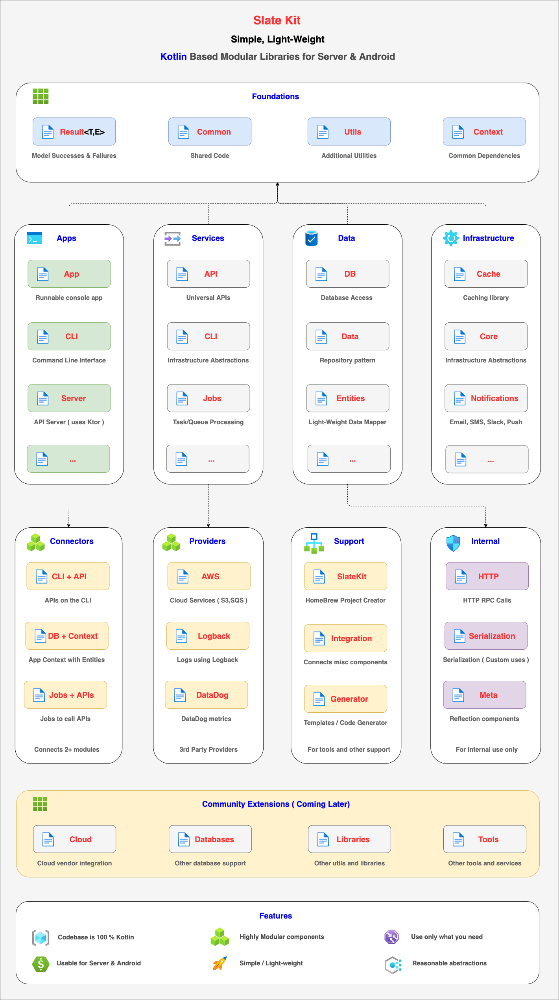

[](https://gitter.im/code-helix/slatekit?utm_source=badge&utm_medium=badge&utm_campaign=pr-badge&utm_content=badge)
[](https://twitter.com/slatekit)


<!--

-->

# About
**Slate Kit** is a collection of architecture components and libraries for full-stack Kotlin development.

num | about | note
-----|------|------
1 | who | For Kotlin **Android**, **Server Side** developers for building startups, mobile apps, personal projects.
2 | what    | This is a modular set of utilities and architecture components.
3 | where  | Reach us on [Gitter](https://gitter.im/code-helix/slatekit), [Twitter](https://twitter.com/slatekit), and log issues on the issues board here.
4 | when | This has been around for 3 years as a internal library which we slowly open-sourced.
5 | why | Designed as reusable modules for any company / product. We use it internally for all projects.
6 | how | Check out our website at www.slatekit.com for more info, overview, details, usage, docs, etc.
7 | compare | Slate Kit is a modern, simple, 100% Kotlin alternative to Spring Framework.

# Install
You can set up gradle using the example below. You can use a little or as many slatekit-components as you need. 

```groovy
repositories {
    maven { url  "https://dl.bintray.com/codehelixinc/slatekit" }
}

dependencies {
	// other libraries
	
	// slatekit-results: Result<T,E> to model successes/failures with optional status codes
    	compile 'com.slatekit:slatekit-results:1.0.0'
	
	// slatekit-common: Utilities for Android or Server
    	compile 'com.slatekit:slatekit-common:0.9.48'
	
	// Misc architecture components ( all depend on results/common components above )
	// Refer to docs for gradle setup for other components
}
```

# Goals
Slate Kit is a Kotlin based open-source set of utilities, libraries and modular architecture components

# Design
Slate Kit is designed as a collection of modular components. In this way, it is more like a library than an `framework`.

# Links
Some important links / pages for more info.

type | link | note
------------ | ------------ | -------------
home | www.slatekit.com | landing page
overview | http://www.slatekit.com/start/overview | goals / uses / philosophy
setup    | www.slatekit.com/start/hello_world | setup slatekit hello world
releases | https://github.com/code-helix/slatekit/releases | relase history 
issues   | https://github.com/code-helix/slatekit/issues | issue tracker
modules  | http://www.slatekit.com/arch/overview   | architecture components
utilities| http://www.slatekit.com/utils/overview  | android and server utils
standards| http://www.slatekit.com/more/standards  | coding standards


# Modules
Slate Kit contains many useful architecture components, utilities and applications features. The slatekit-common has 0 dependencies adn contains most of the common utilities and components used throughout all the other projects. 



docs | source | license | desc | download
------------ | ------------ | ------------- | ------------- | -------------
[slatekit-results](http://www.slatekit.com/utils.html)                  | [src](src/lib/kotlin/slatekit-result)  | Apache2.0     | successes/failures with optional status codes | [  ](https://bintray.com/codehelixinc/slatekit/slatekit-results/_latestVersion)
[slatekit-common](http://www.slatekit.com/utils.html)                  | [src](src/lib/kotlin/slatekit-common)  | Apache2.0    | utilities for android + server | [  ](https://bintray.com/codehelixinc/slatekit/slatekit-common/_latestVersion)
[slatekit-db](http://www.slatekit.com/utils.html)                  | [src](src/lib/kotlin/slatekit-db)  | Apache2.0    | database utilities | [  ](https://bintray.com/codehelixinc/slatekit/slatekit-common/_latestVersion)
[slatekit-query](http://www.slatekit.com/utils.html)                  | [src](src/lib/kotlin/slatekit-query)  | Apache2.0    | query builder for SQL | [  ](https://bintray.com/codehelixinc/slatekit/slatekit-common/_latestVersion)
[slatekit-meta](http://www.slatekit.com/utils.html)                    | [src](src/lib/kotlin/slatekit-meta)   | Apache2.0     | meta/reflection utils | [  ](https://bintray.com/codehelixinc/slatekit/slatekit-meta/_latestVersion)
[slatekit-app](http://www.slatekit.com/app.html)                    | [src](src/lib/kotlin/slatekit-app)     | Apache2.0   | application template | [  ](https://bintray.com/codehelixinc/slatekit/slatekit-core/_latestVersion)
[slatekit-cli](http://www.slatekit.com/cli.html)                    | [src](src/lib/kotlin/slatekit-cli)    | Apache2.0    | command line interface template | [  ](https://bintray.com/codehelixinc/slatekit/slatekit-core/_latestVersion)
[slatekit-core](http://www.slatekit.com/infra.html)                    | [src](src/lib/kotlin/slatekit-core)    | Apache2.0    | architecture components | [  ](https://bintray.com/codehelixinc/slatekit/slatekit-core/_latestVersion)
[slatekit-policy](http://www.slatekit.com/infra.html)                    | [src](src/lib/kotlin/slatekit-policy)    | Apache2.0    | policies to control and respond to code | [  ](https://bintray.com/codehelixinc/slatekit/slatekit-policy/_latestVersion)
[slatekit-notifications](http://www.slatekit.com/infra.html)                    | [src](src/lib/kotlin/slatekit-notifications)    | Apache2.0    | alerts, emails, sms, push notifications | [  ](https://bintray.com/codehelixinc/slatekit/slatekit-notifications/_latestVersion)
[slatekit-entities](http://www.slatekit.com/kotlin-core-orm.html)      | [src](src/lib/kotlin/slatekit-entities)  | Apache2.0  | standardized entity service/repository pattern | [  ](https://bintray.com/codehelixinc/slatekit/slatekit-entities/_latestVersion)
[slatekit-orm](http://www.slatekit.com/kotlin-core-orm.html)      | [src](src/lib/kotlin/slatekit-orm)  | Apache2.0  | database entities/orm | [  ](https://bintray.com/codehelixinc/slatekit/slatekit-entities/_latestVersion)
[slatekit-integration](https://www.slatekit.com)                       | [src](src/lib/kotlin/slatekit-integration) | Apache2.0| integration components | [  ](https://bintray.com/codehelixinc/slatekit/slatekit-integration/_latestVersion)
[slatekit-cloud](http://www.slatekit.com/infra.html)                   | [src](src/lib/kotlin/slatekit-cloud)    | Apache2.0   | clouder services ( AWS ) | [  ](https://bintray.com/codehelixinc/slatekit/slatekit-cloud/_latestVersion)
[slatekit-providers](http://www.slatekit.com/kotlin-core-server.html)     | [src](src/lib/kotlin/slatekit-providers)  | Apache2.0   | 3rd party implementations for Logs/Metrics | [  ](https://bintray.com/codehelixinc/slatekit/slatekit-providers/_latestVersion)
[slatekit-apis](http://www.slatekit.com/kotlin-core-apis.html)         | [src](src/lib/kotlin/slatekit-apis)   | AGPLv3     | api container | [  ](https://bintray.com/codehelixinc/slatekit/slatekit-apis/_latestVersion)
[slatekit-jobs](http://www.slatekit.com/kotlin-core-workers.html)    | [src](src/lib/kotlin/slatekit-jobs)  | AGPLv3   | background jobs for persistant job queues | [  ](https://bintray.com/codehelixinc/slatekit/slatekit-jobs/_latestVersion)
[slatekit-server](http://www.slatekit.com/kotlin-core-server.html)     | [src](src/lib/kotlin/slatekit-server)   | AGPLv3   | http server to run slatekit APIs ( using ktor ) | [  ](https://bintray.com/codehelixinc/slatekit/slatekit-server/_latestVersion)


# Setup
You can use maven/gradle to reference Slate Kit libraries. Refer to [Setup](http://www.slatekit.com/kotlin-setup.html) for more info. Make sure you add the maven url **http://dl.bintray.com/codehelixinc/slatekit**.

```groovy
buildscript {
    ext.kotlin_version = '1.3.21'

    repositories {
        mavenCentral()
    }
    dependencies {
        classpath "org.jetbrains.kotlin:kotlin-gradle-plugin:$kotlin_version"
    }
}

apply plugin: 'java'
apply plugin: 'kotlin'

repositories {
    mavenCentral()
    maven {
        url  "http://dl.bintray.com/codehelixinc/slatekit"
    }
}

dependencies {
    compile "org.jetbrains.kotlin:kotlin-stdlib:$kotlin_version"
    compile "org.jetbrains.kotlin:kotlin-stdlib-jre8:$kotlin_version"
	
    // Reference the slate kit binaries here
    compile 'com.slatekit:slatekit-results:1.0.0'
    compile 'com.slatekit:slatekit-common:0.9.48'
}
```


# License
1. Many of the modules above are Apache 2.0
2. A few modules are LGPL v3 ( listed above )
3. Down the line, a potential premium offering will be available for certain modules/upcoming functionality. These may be offered as both an on-premise solution and as a SaaS. 

# Upcoming
1. Several 1.0.0 releases of various modules


# Contact
- **author**: Kishore Reddy
- **website**: www.slatekit.com
- **company**: www.codehelix.co


# Like Us ? :heart:
- Support Slate Kit by clicking the :star: button on the upper right of this page. :v:
- Contribute to continued development 
