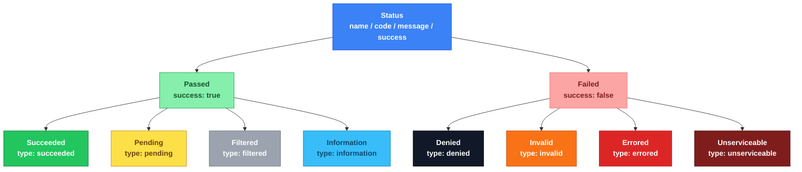

# kiit-codes

**Artifact** : `dev.kiit:kiit-codes`
**Package**  : `kiit.codes`
**Category** : `core`

Platform-agnostic status and error code types. Describes the outcome of any operation — a service call, a background job step, an API request — using a consistent, structured shape rather than raw exceptions or ad-hoc booleans.

---

## Example

Every `Status` can be represented as a structured response, for example as an API error body:

```json
{
    "name"   : "TOKEN_EXPIRED",
    "type"   : "denied",
    "code"   : 400009,
    "success": false,
    "message": "Session token expired"
}
```

---
## Purpose

1. **Universal**  — Usable at any layer: service, background job, route handler, CLI command.
2. **Hierarchy**  — Logical grouping of successes and failures for branching and aggregation.
3. **Standard**   — Precise, consistent status representation across all layers and targets.
4. **Compliant**  — Convertible to HTTP status codes via a `CodeLookup` implementation such as `CodesToHttp`.
5. **Reusable**   — A single status instance can be shared across many call sites.
6. **Extensible** — Create domain codes by constructing `Passed.*` or `Failed.*` subtypes directly.
7. **Searchable** — `name` and `type` are stable, unique keys suitable for log queries.
8. **Aggregated** — The `type` or `name` can be grouped and counted in logs and metrics.
9. **Exceptions** — Compatible with exception patterns; wrap a `Status` in an exception to propagate it across call boundaries.

---
## Hierarchy

Categories are closed/sealed and fixed by design, to enforce a consistent taxonomy across every
consumer. Individual codes *within* a category are open — create new domain codes by constructing
a `Passed` or `Failed` subtype directly (see [Built-in Codes](#built-in-codes) for the built-in set).

```
Status = Passed    | Failed
Passed = Succeeded | Pending | Filtered | Information
Failed = Denied    | Invalid | Errored  | Unserviceable
```


---

## Grouping

| Parent   | Type            | Level  | `success` | Purpose                                                        |
|----------|-----------------|--------|-----------|------------------------------------------------------------------|
| `Status` | `Passed`        | Parent | —         | Parent of all non-failure statuses                              |
| `Passed` | `Succeeded`     | Child  | `true`    | Operation's primary purpose completed                            |
| `Passed` | `Pending`       | Child  | `true`    | Accepted but not yet fully processed                             |
| `Passed` | `Filtered`      | Child  | `true`    | Excluded from normal output — not processed, or processed and discarded |
| `Passed` | `Information`   | Child  | `true`    | Informational / metadata response, no primary operation performed |
| `Status` | `Failed`        | Parent | —         | Parent of all failure statuses                                   |
| `Failed` | `Denied`        | Child  | `false`   | Security / access-control failure                                |
| `Failed` | `Invalid`       | Child  | `false`   | The request as given cannot be satisfied — bad or missing input  |
| `Failed` | `Errored`       | Child  | `false`   | Known, expected business-rule failure                            |
| `Failed` | `Unserviceable` | Child  | `false`   | Valid & permitted, but can't be serviced right now — capacity, timeout, unimplemented, or truly unexpected |

---

## Shape

Every `Status` carries the following fields:

| Field     | Property  | Purpose                                                                                          |
|-----------|-----------|---------------------------------------------------------------------------------------------------|
| `name`    | `name`    | Unique domain label, e.g. `TOKEN_EXPIRED`, `RATE_LIMITED`. Stable — used as a log key.            |
| `code`    | `code`    | Numeric code. Grouped by category by convention, but NOT a literal HTTP code — convert via a `CodeLookup` (e.g. `CodesToHttp`). |
| `message` | `message` | Human-readable description. Must be a constant — never constructed from runtime data.             |
| `success` | `success` | Boolean shortcut for callers that don't need to narrow the sealed type.                            |

---

## Built-in Codes

The `Codes` object provides a standard registry. All codes are optional — create domain-specific
codes by constructing any `Passed` or `Failed` subtype directly. Every code's uniqueness is
enforced at object-init time — a duplicate code fails loudly the first time `Codes` is touched.

The `HTTP` column below reflects the default mapping from `CodesToHttp` — a category default,
unless a specific code has an override (see [HTTP Conversion](#http-conversion)).

### Succeeded (200000-200099)

| Code      | Value  | HTTP |
|-----------|--------|------|
| `SUCCESS` | 200001 | 200  |
| `CREATED` | 200002 | 201  |
| `UPDATED` | 200003 | 200  |
| `FETCHED` | 200004 | 200  |
| `PATCHED` | 200005 | 200  |
| `DELETED` | 200006 | 200  |
| `HANDLED` | 200007 | 204  |

### Pending (200100-200199)

| Code      | Value  | HTTP |
|-----------|--------|------|
| `PENDING` | 200101 | 202  |
| `QUEUED`  | 200102 | 202  |
| `CONFIRM` | 200103 | 200  |

### Filtered (200200-200299)

Covers both "not processed at all" (`SKIPPED`) and "processed, then the result was deliberately
discarded" (`DISCARDED`) — the distinction is carried by name/code, not by separate types.

| Code        | Value  | HTTP |
|-------------|--------|------|
| `SKIPPED`   | 200201 | 200  |
| `DISCARDED` | 200202 | 200  |

### Information (200300-200399)

| Code      | Value  | HTTP |
|-----------|--------|------|
| `HELP`    | 200301 | 200  |
| `ABOUT`   | 200302 | 200  |
| `VERSION` | 200303 | 200  |
| `EXIT`    | 200304 | 200  |

### Denied (400000-400099) — security / access-control

| Code               | Value  | HTTP |
|--------------------|--------|------|
| `DENIED`           | 400001 | 401  |
| `UNAUTHENTICATED`  | 400002 | 401  |
| `UNAUTHORIZED`     | 400003 | 401  |

### Invalid (400100-400199) — bad input

| Code          | Value  | HTTP |
|---------------|--------|------|
| `BAD_REQUEST` | 400101 | 400  |
| `INVALID`     | 400102 | 400  |
| `NOT_FOUND`   | 400103 | 404  |

### Errored (500000-500099) — known, expected business-rule failure

| Code         | Value  | HTTP |
|--------------|--------|------|
| `MISSING`    | 500001 | 400  |
| `FORBIDDEN`  | 500002 | 403  |
| `CONFLICT`   | 500003 | 409  |
| `DEPRECATED` | 500004 | 426  |
| `ERRORED`    | 500005 | 500  |

### Unserviceable (500100-500199) — valid & permitted, can't be serviced right now

| Code                 | Value  | HTTP |
|----------------------|--------|------|
| `UNIMPLEMENTED`      | 500101 | 501  |
| `UNSUPPORTED`        | 500102 | 501  |
| `TIMEOUT`            | 500103 | 408  |
| `RATE_LIMITED`       | 500104 | 429  |
| `UNREACHABLE`        | 500105 | 503  |
| `UNDER_MAINTENANCE`  | 500106 | 503  |
| `UNEXPECTED`         | 500107 | 500  |

---

## HTTP Conversion

`CodeLookup` is a direction-explicit, bidirectional conversion between a `Status` and a target
protocol's status code (e.g. HTTP) — `toCode(status): Int` / `toStatus(code): Status?` — so the
two code spaces (internal registry code vs. HTTP code) can never be silently confused at a call
site.

`CodesToHttp` is the default HTTP implementation. `toCode` is an exhaustive `when` over `Status`'s
categories (a missing category is a compile error, not a silent fallback), layered with a small
overrides map for the handful of codes that differ from their category's default (e.g. `CREATED`
-> 201 vs. `Succeeded`'s default 200). `toStatus` is derived from `toCode`, so the two directions
can never drift apart from each other. An unrecognized HTTP code returns `null` — the caller
decides the fallback, rather than the library guessing one from a numeric range.

```kotlin
val http = CodesToHttp()
http.toCode(Codes.CREATED)     // 201
http.toCode(Codes.DENIED)      // 401 (category default)
http.toStatus(404)?.name       // "NOT_FOUND"
http.toStatus(999)             // null — unrecognized code, no guessed fallback
```

`CompositeLookup` composes a base `CodeLookup` with client-supplied extensions, without
subclassing `CodesToHttp` — composition over inheritance. It's keyed by the actual `Status`
instance (not just its code), so custom statuses outside the `Codes` registry are also
reverse-lookupable via `toStatus`:

```kotlin
val PAYMENT_DECLINED = Failed.Errored("PAYMENT_DECLINED", 700123, "Payment declined")
val lookup = CompositeLookup(base = CodesToHttp(), extensions = mapOf(PAYMENT_DECLINED to 402))

lookup.toCode(PAYMENT_DECLINED)  // 402
lookup.toStatus(402)             // PAYMENT_DECLINED
lookup.toCode(Codes.DENIED)      // 401 — falls back to the base lookup
```

---

## Exceptions

`StatusException` and `StatusError` let you propagate a structured `Status` across call
boundaries using the platform's native exception mechanism, without losing the structured
information.

### JVM / Android — `StatusException`

```kotlin
throw StatusException(Codes.UNAUTHORIZED)

// with a cause
throw StatusException(Codes.TIMEOUT, cause = ioException)

try {
    // ...
} catch (e: StatusException) {
    when (e.status) {
        is Failed.Denied         -> // handle auth failure
        is Failed.Invalid        -> // handle bad input
        is Failed.Errored        -> // handle known business-rule failure
        is Failed.Unserviceable  -> // handle capacity / timeout / unimplemented / unexpected
        is Passed                -> // n/a — Passed statuses aren't normally thrown
    }
}
```

### JS / TypeScript — `StatusError`

`StatusError` is exported to the `.d.ts` file so TypeScript consumers see an idiomatic name:

```ts
import { StatusError, Codes } from '@kiit/codes'

throw new StatusError(Codes.UNAUTHORIZED)

try { ... } catch (e) {
    if (e instanceof StatusError) { console.log(e.status.name) }
}
```

### iOS / Swift — `StatusError`

`@ObjCName("StatusError")` gives Swift consumers an idiomatic name instead of the
auto-generated `KiitCodesStatusException` form:

```swift
do {
    try someKotlinApi()
} catch let e as StatusError {
    print(e.status.name)  // e.g. "UNAUTHORIZED"
}
```

### Platform summary

| Platform       | Class              | How                                         |
|----------------|--------------------|---------------------------------------------|
| JVM / Android  | `StatusException`  | `commonMain` — extends `Exception`          |
| JS / TS        | `StatusError`      | `jsMain` — `@JsExport` subclass             |
| iOS / Swift    | `StatusError`      | `iosMain` — `@ObjCName` subclass            |

---

## Related

**kiit-result** — Wraps a value (`Success<T>`) or error (`Failure<E>`) and uses `Status` codes
as the error discriminant. `kiit-codes` is a dependency of `kiit-result`.

**GraphQL** — The closest external analogue is `MutationError` in the GraphQL ecosystem:
```json
{ "code": 403, "message": "Unauthorized" }
```
`Status` provides the same contract with a richer hierarchy and a stable `name` key.
