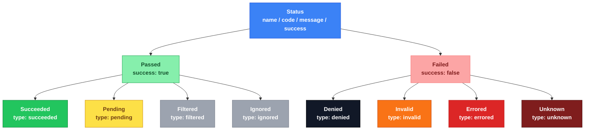

# kiit-codes

**Artifact** : `dev.kiit:kiit-codes`
**Package**  : `kiit.codes`
**Category** : `core`

Platform-agnostic status and error code types. Describes the outcome of any operation — a service call, a background job step, an API request — using a consistent, structured shape rather than raw exceptions or ad-hoc booleans.

---

## Example

Every `Status` can be represented as a structured response, for example as an API error body:

```json
{
    "name"   : "TOKEN_EXPIRED",
    "code"   : 400009,
    "success": false,
    "message": "Session token expired"
}
```

---
## Purpose

1. **Universal**  — Usable at any layer: service, background job, route handler, CLI command.
2. **Hierarchy**  — Logical grouping of successes and failures for branching and aggregation.
3. **Standard**   — Precise, consistent status representation across all layers and targets.
4. **Compliant**  — Convertible to HTTP status codes via `Codes.toHttp(status)`.
5. **Reusable**   — A single status instance can be shared across many call sites.
6. **Extensible** — Create domain codes by constructing `Passed.*` or `Failed.*` subtypes directly.
7. **Searchable** — `name` and `type` are stable, unique keys suitable for log queries.
8. **Aggregated** — The `type` or `name` can be grouped and counted in logs and metrics.
9. **Exceptions** — Compatible with exception patterns; wrap a `Status` in an exception to propagate it across call boundaries.

---
## Hierarchy

```
Status = Passed | Failed
Passed = Succeeded | Pending | Filtered | Ignored
Failed = Denied | Invalid | Errored | Unknown
```


---

## Grouping

| Parent   | Type        | Level  | `success` | Purpose                                |
|----------|-------------|--------|-----------|----------------------------------------|
| `Status` | `Passed`    | Parent | —         | Parent of all non-failure statuses     |
| `Passed` | `Succeeded` | Child  | `true`    | Operation completed successfully       |
| `Passed` | `Pending`   | Child  | `true`    | Accepted but not yet fully processed   |
| `Passed` | `Filtered`  | Child  | `true`    | Intentionally excluded from processing |
| `Passed` | `Ignored`   | Child  | `true`    | Processed but result discarded         |
| `Status` | `Failed`    | Parent | —         | Parent of all failure statuses         |
| `Failed` | `Denied`    | Child  | `false`   | Security / access-control failure      |
| `Failed` | `Invalid`   | Child  | `false`   | Malformed or invalid input data        |
| `Failed` | `Errored`   | Child  | `false`   | Known business-rule failure            |
| `Failed` | `Unknown`   | Child  | `false`   | Unexpected or unhandled failure        |

---

## Shape

Every `Status` carries the following fields:

| Field     | Property  | Purpose                                                                                 |
|-----------|-----------|-----------------------------------------------------------------------------------------|
| `name`    | `name`    | Unique domain label, e.g. `TOKEN_EXPIRED`, `RATE_LIMITED`. Stable — used as a log key. |
| `code`    | `code`    | Numeric code. Defaults align with HTTP ranges; convert via `Codes.toHttp(status)`.      |
| `message` | `message` | Human-readable description. Must be a constant — never constructed from runtime data.   |
| `success` | `success` | Boolean shortcut for callers that don't need to narrow the sealed type.                 |

---

## Built-in Codes

The `Codes` object provides a standard registry. All codes are optional — create domain-specific
codes by constructing any `Passed` or `Failed` subtype directly.

### Succeeded (200xxx)

| Code            | Value  | HTTP |
|-----------------|--------|------|
| `SUCCESS`       | 200001 | 200  |
| `CREATED`       | 200002 | 201  |
| `UPDATED`       | 200003 | 200  |
| `FETCHED`       | 200004 | 200  |
| `PATCHED`       | 200005 | 200  |
| `DELETED`       | 200006 | 200  |
| `HANDLED`       | 200007 | 204  |
| `EXIT`          | 600002 | 503  |
| `HELP`          | 600003 | 200  |
| `ABOUT`         | 600004 | 200  |
| `VERSION`       | 600005 | 200  |

### Pending (200xxx)

| Code       | Value  | HTTP |
|------------|--------|------|
| `PENDING`  | 200008 | 202  |
| `QUEUED`   | 200009 | 202  |
| `CONFIRM`  | 200010 | 200  |
| `ACTIVE`   | 200101 | 200  |
| `INACTIVE` | 200102 | 200  |
| `STARTING` | 200103 | 200  |
| `WAITING`  | 200104 | 200  |
| `RUNNING`  | 200105 | 200  |
| `PAUSED`   | 200106 | 200  |
| `STOPPED`  | 200107 | 200  |
| `COMPLETE` | 200108 | 200  |

### Passed — Filtered / Ignored (200xxx)

| Code       | Value  | HTTP |
|------------|--------|------|
| `FILTERED` | 200204 | 200  |
| `IGNORED`  | 200204 | 200  |

### Denied (400xxx)

| Code              | Value  | HTTP |
|-------------------|--------|------|
| `DENIED`          | 400005 | 401  |
| `UNSUPPORTED`     | 400006 | 501  |
| `UNIMPLEMENTED`   | 400007 | 501  |
| `UNAVAILABLE`     | 400008 | 503  |
| `UNAUTHENTICATED` | 400009 | 401  |
| `UNAUTHORIZED`    | 400010 | 401  |

### Invalid (400xxx)

| Code          | Value  | HTTP |
|---------------|--------|------|
| `BAD_REQUEST` | 400002 | 400  |
| `INVALID`     | 400003 | 400  |
| `NOT_FOUND`   | 400004 | 404  |

### Errored (500xxx)

| Code         | Value  | HTTP |
|--------------|--------|------|
| `MISSING`    | 500002 | 400  |
| `FORBIDDEN`  | 500003 | 403  |
| `CONFLICT`   | 500004 | 409  |
| `DEPRECATED` | 500005 | 426  |
| `TIMEOUT`    | 500006 | 408  |
| `ERRORED`    | 500007 | 500  |
| `LIMITED`    | 500009 | 500  |

### Unknown (500xxx)

| Code         | Value  | HTTP |
|--------------|--------|------|
| `UNEXPECTED` | 500008 | 500  |

---

## Exceptions

`StatusException` and `StatusError` let you propagate a structured `Status` across call
boundaries using the platform's native exception mechanism, without losing the structured
information.

### JVM / Android — `StatusException`

```kotlin
throw StatusException(Codes.UNAUTHORIZED)

// with a cause
throw StatusException(Codes.TIMEOUT, cause = ioException)

try {
    // ...
} catch (e: StatusException) {
    when (e.status) {
        is Failed.Denied  -> // handle auth failure
        is Failed.Errored -> // handle business error
        else              -> // ...
    }
}
```

### JS / TypeScript — `StatusError`

`StatusError` is exported to the `.d.ts` file so TypeScript consumers see an idiomatic name:

```ts
import { StatusError, Codes } from '@kiit/codes'

throw new StatusError(Codes.UNAUTHORIZED)

try { ... } catch (e) {
    if (e instanceof StatusError) { console.log(e.status.name) }
}
```

### iOS / Swift — `StatusError`

`@ObjCName("StatusError")` gives Swift consumers an idiomatic name instead of the
auto-generated `KiitCodesStatusException` form:

```swift
do {
    try someKotlinApi()
} catch let e as StatusError {
    print(e.status.name)  // e.g. "UNAUTHORIZED"
}
```

### Platform summary

| Platform       | Class              | How                                         |
|----------------|--------------------|---------------------------------------------|
| JVM / Android  | `StatusException`  | `commonMain` — extends `Exception`          |
| JS / TS        | `StatusError`      | `jsMain` — `@JsExport` subclass             |
| iOS / Swift    | `StatusError`      | `iosMain` — `@ObjCName` subclass            |

---

## Related

**kiit-result** — Wraps a value (`Success<T>`) or error (`Failure<E>`) and uses `Status` codes
as the error discriminant. `kiit-codes` is a dependency of `kiit-result`.

**GraphQL** — The closest external analogue is `MutationError` in the GraphQL ecosystem:
```json
{ "code": 403, "message": "Unauthorized" }
```
`Status` provides the same contract with a richer hierarchy and a stable `name` key.
